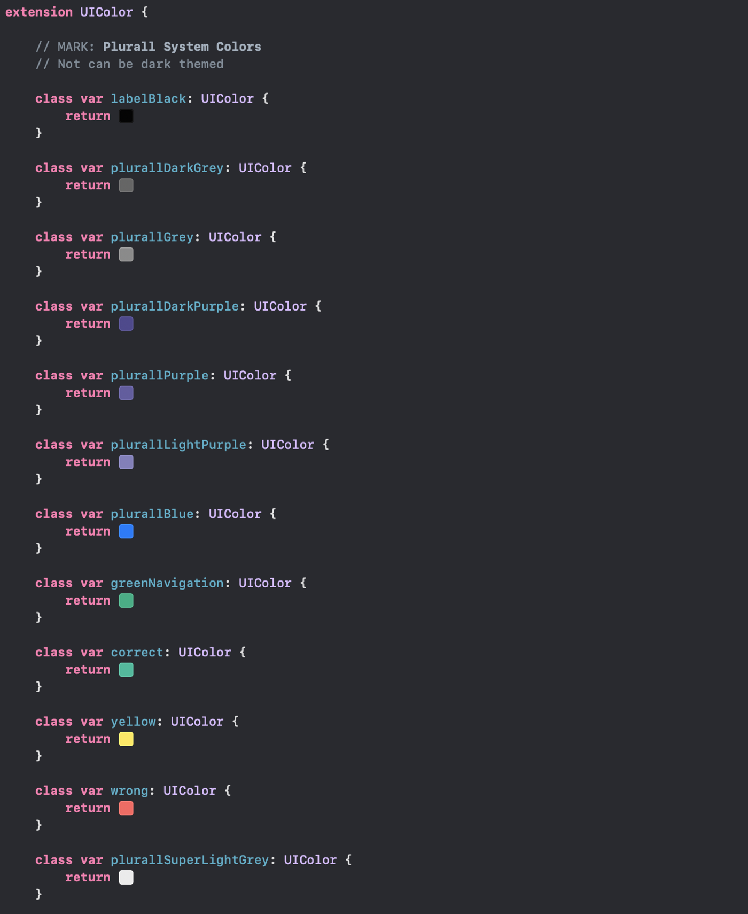

My app supports from iOS 9 to the latest released by Apple (13) and I would like it to be dark theme and light theme. It's possible?
Searching for WWDC articles I noticed that the way Apple does is using

### Colors.assets ### 

PRETTY! I created a color asset in the app and started setting it up. But… what I feared came true. Support only for the. iOS 11+. Great Scott!

## Color Document ## 
I had to think of other ways to do something sustainable and work.
Starting with creating an extension called

#### Color.swift #### 

My Color ExtensionUse Color Literal for fuller and more native viewing. All app colors should be there, organized and standardized 👌. Say goodbye to colorWithHex () 😎 💁
Wonderful, but how would this work as dark mode? Simple, separate the colors that are dark themed and those that are not. For example, Plurall is my app name and purple is its color, it should not necessarily be dark themed.
The following is an example of colors that contemplate both theme types (can be scaled for more than that 👨‍💻)
Dark Themed ColorsWhy this Colors?
I keep these variables above to the same extent and they are color changeable. The system understands perfectly when to use each one. But where did I get in those dark colors? Why of them?
Well, I'm not officially a designer, I don't have this skill but I venture anyway ☺️.
But then, what about the dark colors? I used the Inverted Color technique (here a site that will help you invert the color - Invert Colors), so I can maintain the same contrast and visualization usability that my app had before Dark Mode, using colors that still talk to each other.
And why does Apple use full-black in its native apps? The high-end iPhones (iPhone X, iPhone XS and iPhone 11 Pro) contain OLED screen and black is faithful, these screens can uses less battery in black pixels.
So, this is how I developed this feature for the app that can work from iOS 9. As seen in the code, it still does not work in the past iOS, this is a decision we still have to talk internally, but it is easy to implement this change .
I think it's time to show how the app is doing, right?

Login Screen(Plurall only works on Brazil, sorry)
Here are some examples of the dark mode.

Side menu, I know, need to update this 😑
A Task Workflow(app for students)
Works also in WKWebKit 😎
There is only one "bad" side to this whole story, setting the colors manually 😒.
 If you use XIB or Storyboard (like me) it will be more work, but nothing too painful. If you're one of those who does the whole layout via code, nothing changes for you, champion! Either way you'll find a lot of it out there!
Setting colors programmatically

---

From this, I will talk with the design team and see what changes we can make for a better view, I can see some display failures, not respecting the 21: 1 or even 4.5: 1 contrast.
Apart from this visual change, what has changed?
Well, I revisited all the code (it's an old app, a lot of legacy stuff) and put it in my head: - Don't refactor complex things, fix force unwraps and other easy-to-maintain silly things.
So, I tweaked all the app colors (which were a mess,), tweaked small errors from XIBs and Storyboards, removed countless classes that weren't relevant, and again, the app colors are completely organized and visual.
I hope I have helped everyone looking for this change. If you would like to extend the discussion, call me on Twitter
Happy Coding :)
