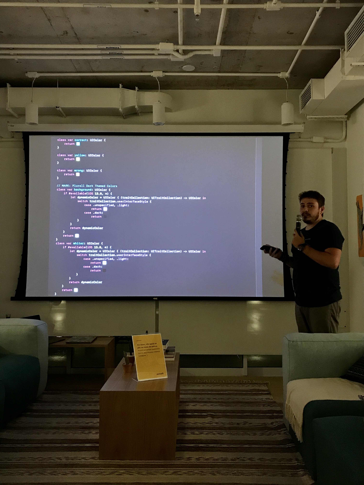

## About Me ##

Im Fabrício Masiero, 28 year old iOS Engineer, working at SOMOS Educação. From São Paulo and working remotely.
Im a iOS Developer over 8 years and worked in a lot of projects. I have more than 20 apps published on AppStore. Some o theses with millions users. Today Im working on Education app in Brazil, with more than 1M active users, working to this project more than 3 years long,

Ola, sou Fabrício Masiero, 28 anos iOS Engineer de São Paulo e trabalhando remoto pelos últimos 3 anos. Atualmente trabalho na SOMOS Educação(maior empresa de educação do Brasil e uma das maiores do mundo).
Trabalho com desenvolvimento iOS ha mais de 8 anos. Atuei em diversos projetos diferentes, com mais de 20 aplicativos publicados na AppStore. Alguns deles tem milhoes de usuários. Hoje lidero a equipe iOS no Plurall, app que tem mais de 1M de usuários ativos e tem como principal missão levar educação básica para todos no Brasil. Nesse app trabalho como as seguintes ferramentas e metodologias: Swift, Realm, RxSwift, Swinject, Alamofire, CoreData, ViewCode and XIB, APIRest, GraphQL MVVM, Clean Architecture, Fastlane, aspectos de UX/UI e outras coisas.
Já trabalhei em projetos passados com: SwiftUI, Combine, Catalyst, XMPP, Unity3D Integration, Objective-C, SOAP, MVC, Storyboard, PHP CodeIgniter, Ruby On Rails e etc.

<!--  -->
<!-- 

    

 -->
<!-- 

 -->

<!-- {height=20px width=20px} -->

<!--  -->

